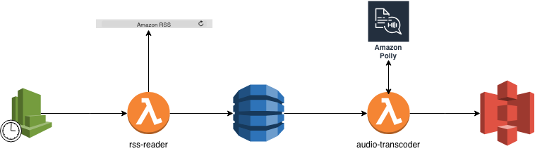
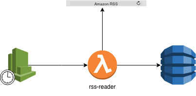
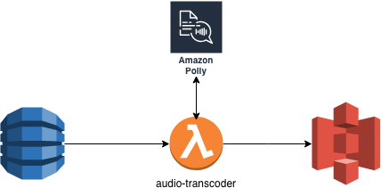
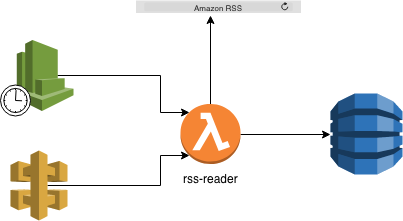

# pulumi-handson
If you are here, you belive that you can code you infrastructure using your favorite programming language.
During this journey, 

In this hands-on we are going to read a rssFeed, convert it to MP3 and saved the feed in database.

We are going to use the folowing service:

- Lambda
- CloudWatch 
- DynamoDB
- Polly
- S3
- Api-gateway

So let's get started :blush:

## First Step : Prepare the field

For this hands-on you need to install node version 8.9
you can use node version manager to handle multiple node version

the installation instruction are available here: https://github.com/creationix/nvm

To check you install: `nvm --version`

Now you can install node 8.9.4 using : `nvm i 8.9.4`

To check you node default version: `node --version`

You can use `nvm use 8.9.4` to switch node version

To Install pulumi you can copy and paste this command in your terminal : `curl -fsSL https://get.pulumi.com | sh`

To check you pulumi version: `pulumi version`

## Second Step : Prepare the weapon

Now you can checkout the projet and start coding :cloud:

- In th main route of the project you have to run `npm i` to install the pulumi depencencies
- you need also to define your Pulumi stack  `pulumi stack init` : you can call your stack `stack
- you need to set francfort as aws region `pulumi config set aws:region eu-central-1`

## Third Step : Fight

### Create the Rss reader function

The RssReader function read every day the aws rssFeed and save it on dynamoDB

The function code is availaible on the package rs-reader

- Create the RssReaderRole:
    https://pulumi.io/reference/pkg/nodejs/@pulumi/aws/iam/#Role
    https://pulumi.io/reference/pkg/nodejs/@pulumi/aws/iam/#RolePolicy
    You can use this statements:
    
    > [{
            Action: "sts:AssumeRole",
            Principal: {
                Service: "lambda.amazonaws.com"
            },
            Effect: "Allow",
            Sid: ""
        }]
        
    > [{
        Action: ["cloudwatch:*","dynamodb:*","logs:CreateLogGroup","logs:CreateLogStream","logs:PutLogEvents","logs:DescribeLogStreams"],Effect: "Allow",Resource: "*"
     }]
    
    Your function should be able to to acces to cloudwatch and dynamoDB
    
    You should export the created variables.
    
- Launch `pulumi up` to deploy the created role
- You can check the IAM service on the AWS console: https://console.aws.amazon.com/iam/home?region=eu-central-1#/home 
- Create your function with the created role
    https://pulumi.io/reference/pkg/nodejs/@pulumi/aws/lambda/#Function
    you should export the created function.
- You can check the Lambda service on the AWS console: https://eu-central-1.console.aws.amazon.com/lambda/home?region=eu-central-1#/functions
- Create DynamoDB table:
    https://pulumi.io/reference/pkg/nodejs/@pulumi/aws/dynamodb/#Table
    You should export the created table.
- You can check the created table on the AWS console : https://eu-central-1.console.aws.amazon.com/dynamodb/home?region=eu-central-1
    https://eu-central-1.console.aws.amazon.com/dynamodb/home?region=eu-central-1#
- Add the the table name to the function enviromenent Variable  
- Create scheduled event to launch the function periodcally
    https://pulumi.io/reference/pkg/nodejs/@pulumi/aws/cloudwatch/#EventRule
- Connect the scheduled event to your lambda function
    https://pulumi.io/reference/pkg/nodejs/@pulumi/aws/cloudwatch/#EventRuleEventSubscription
    You should export the scheduled event.
- Launch `pulumi up` to deploy the stack

You can test your function: https://pulumi.io/reference/pkg/nodejs/@pulumi/aws/lambda/#Function

In your lambda function, you can test it using the test functonality available on the AWS console

You don't need to specify any event or data, just save the test and click on test to trigger your lambda function.

You can select DynamoDB service and check if you have the last AWS's blog articles

### Create the audio transcoder function

- Create the S3 bucket:
    https://pulumi.io/reference/pkg/nodejs/@pulumi/aws/s3/#Bucket
    
- Create the AudioTranscoderRole
   Your function should be able to to acces to cloudwatch, dynamoDB,polly and s3
   
   > [{
           Action: "sts:AssumeRole",
           Principal: {
               Service: "lambda.amazonaws.com"
           },
           Effect: "Allow",
           Sid: ""
       }]
       
   > [{
       Action: ["polly:*",
           "cloudwatch:*",
           "s3:*","dynamodb:*",
           "logs:CreateLogGroup",
           "logs:CreateLogStream",
           "logs:PutLogEvents",
           "logs:DescribeLogStreams"],
       Effect: "Allow",
           Resource: "*"
    }]
    
- Create your function with the created role

- Create a connect the dynamoDB stream to the AudioTrancoder function
    the function will be triggred when new item is added to the table
    https://pulumi.io/reference/pkg/nodejs/@pulumi/aws/dynamodb/#TableEventSubscription

- Add the the bucket name to the AudiTranscoder function enviromenent variable  

- launch `pulumi up` to update your stack

### Trigger the RssReader Manually:

Some time we need to sychronize the articles manually. To do this we are going to make http call.

- Create an http endpoint to trigger the RssReader function
    https://pulumi.io/reference/pkg/nodejs/@pulumi/aws/apigateway/#RestApi

- export the created variable
- you can test the new feature by a simple curl
  

